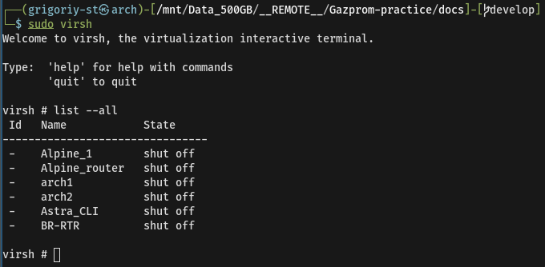
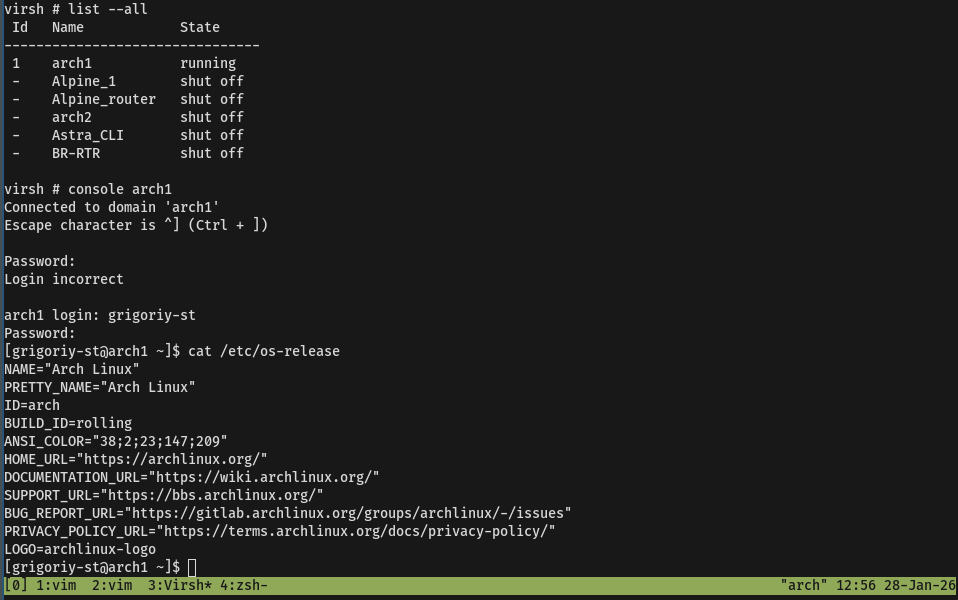
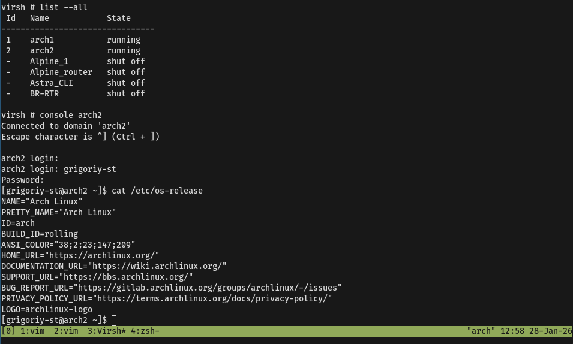
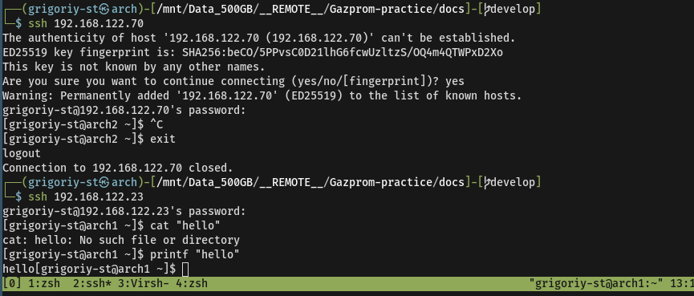
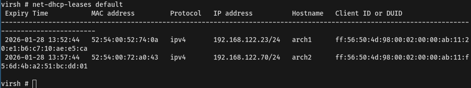
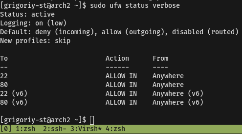
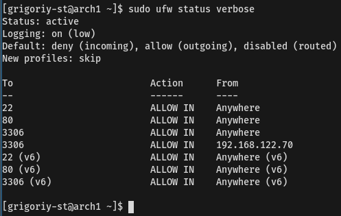
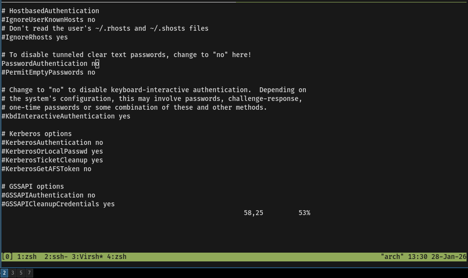
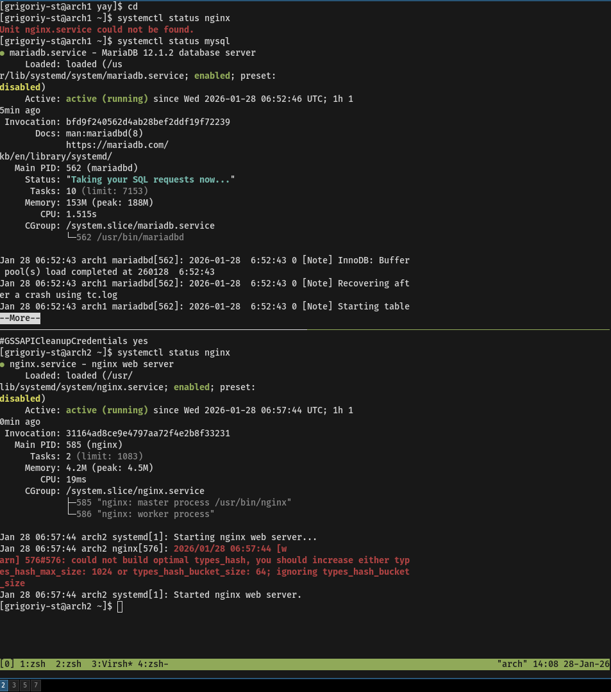
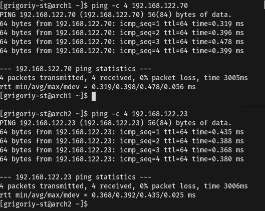

# Задание на производственную практику

## Направление: Администрирование Linux-систем с элементами DevOps

### Тема: Развертывание и автоматизация отказоустойчивого веб-приложения в облачной 
среде

### Цель: Получить практический опыт построения инфраструктуры "как код" (IaC), настройки CI/CD пайплайна, контейнеризации приложения, обеспечения мониторинга и отказоустойчивости.

### Итоговый результат:

1. Автоматически разворачиваться из кода.
2. Быть отказоустойчивой (с балансировщиком нагрузки).
3. Иметь автоматизированный пайплайн сборки и деплоя.
4. Находиться под мониторингом.
5. Быть задокументирована.

## Поэтапный план задания:

### Этап 1: Подготовка и базовое администрирование (Неделя 1)

Задача: Создать и настроить базовую инфраструктуру вручную для понимания компонентов.

Действия:
- [x] Локально развернул 2 виртуальные машины через KVM.

- [x] Установил ОС Arch linux.

- [x] Настроил SSH-доступ с использованием ключевой аутентификации

- [x] Обновил систему через `pacman -Syy`
- [x] Настроил hostname через команду `hostnamectl sethostname "arch1"`
- [x] Выдал сетевые адреса по  DHCP

- [x] Настроил файрвол (ufw)

- [x] Отклтключил вход по паролю.

На одной VM установил и настроил Nginx, на другой — базу данных MariaDB. 

Обеспечил сетевое взаимодействие между ними.

### Этап 2: Автоматизация развертывания инфраструктуры (IaC) (Неделя 1)
Задача: Ликвидировать "ручное" создание и автоматизировать процесс с помощью Terraform.

Действия:
Написать конфигурации Terraform для создания:
Сети и подсетей.
Групп безопасности (Security Groups) с минимально необходимыми правилами.
ВМ (2 инстанса для приложения, 1 для мониторинга).
Дисков для данных.
Реализовать использование переменных (variables), вынести чувствительные данные в terraform.tfvars.
Инициализировать бэкенд для хранения состояния (state) (можно использовать S3-совместимое хранилище или локально).

Критерии проверки: Предоставлен код Terraform. Инфраструктура создается и уничтожается одной командой. Состояние хранится удаленно.

### Этап 3: Конфигурационный менеджмент и оркестрация (Неделя 2)
Задача: Установить и настроить необходимое ПО на созданные ВМ единообразно и воспроизводимо.

Действия:
Написать Ansible playbooks для:
Базовой настройки всех хостов (пользователи, ssh, обновления, timezone).
Установки и настройки Docker и Docker Compose на хостах приложения.
Установки и настройки Prometheus и Grafana на хосте мониторинга.
Использовать roles, templates, variables для организации кода.
Создать inventory-файл, динамически сгенерированный из вывода Terraform.

Критерии проверки: Предоставлен код Ansible. После применения playbooks на "чистых" системах устанавливается и запускается Docker, Prometheus.

### Этап 4: Контейнеризация приложения (Неделя 2)
Задача: Упаковать приложение и его зависимости в Docker-контейнеры.

Действия:
Написать Dockerfile для выбранного веб-приложения (можно взять готовое из репозитория, например, nginx:alpine с простой статикой).
Написать docker-compose.yml для развертывания multi-container приложения (например, веб-сервер + БД + кэш Redis).
Создать пользовательскую bridge-сеть для изоляции контейнеров.
Настроить тома (volumes) для сохранения данных БД.
Критерии проверки: Предоставлены Dockerfile и docker-compose.yml. Приложение запускается локально командой docker-compose up.

### Этап 5: Настройка CI/CD пайплайна (Неделя 3)

Задача: Автоматизировать сборку образа и его деплой при обновлении кода.

Действия:
Создать репозиторий на GitHub/GitLab.
Написать пайплайн (GitHub Actions / GitLab CI) с двумя стадиями:
Build: Сборка Docker-образа и его публикация в Container Registry (Docker Hub, GitLab Registry, Yandex Container Registry).
Deploy: Запуск Ansible playbook (из Этапа 3) для обновления контейнеров на production-хостах (используя docker-compose pull && docker-compose up -d).

Настроить секреты (secrets) в CI/CD системе для хранения ключей доступа.

Критерии проверки: Пайплайн успешно выполняется при push в репозиторий. Новый образ деплоится на прод без простоев (rolling update).

### Этап 6: Оркестрация, балансировка нагрузки, мониторинг (Неделя 3)

Задача: Обеспечить отказоустойчивость и наблюдаемость системы.

Действия:
Развернуть Docker Swarm или минимальный кластер Kubernetes (k3s) на двух нодах вместо standalone Docker.
Переписать docker-compose.yml в формат docker stack deploy или написать простой манифест для Kubernetes (Deployment, Service).
Установить и настроить Nginx в качестве reverse proxy/балансировщика нагрузки перед приложением (можно использовать Ingress в k8s).
Настроить сбор метрик (CPU, RAM, Disk) с хостов и контейнеров в Prometheus.
В Grafana создать дашборд с ключевыми метриками приложения и инфраструктуры.
Настроить простой алерт в Prometheus/Grafana (например, на высокую загрузку CPU).

Критерии проверки: Приложение доступно через балансировщик. При остановке одного контейнера приложение продолжает работать. Доступен дашборд в Grafana с актуальными метриками.

### Этап 7: Документирование и финальный отчет (Неделя 4)

Задача: Зафиксировать проделанную работу.

Действия:
Создать README.md в репозитории с описанием проекта, архитектуры и инструкцией по развертыванию.
Составить схему архитектуры (можно в draw.io или Miro).
Написать итоговый отчет по практике, объяснив логику принятых решений и проблемы, с которыми столкнулся.

Критерии проверки: Предоставлена полная документация и отчет. По инструкции из README можно развернуть всю инфраструктуру с нуля.

Рекомендуемые технологии:
Облако/Виртуализация: Yandex Cloud, AWS Free Tier, Proxmox/KVM.

IaC: Terraform.

Конфигурационный менеджмент: Ansible.

Контейнеризация: Docker, Docker Compose.

Оркестрация: Docker Swarm / Kubernetes (k3s).

CI/CD: GitHub Actions, GitLab CI.

Мониторинг: Prometheus, Grafana, node_exporter.

Веб-сервер/Балансировщик: Nginx.

Системы управления версиями: Git.

### ***Задание "Гибридный кластер с миграцией stateful-приложения и полным циклом GitOps"

Контекст: Вы пришли в компанию, где есть устаревшая инфраструктура (bare-metal/VMs) и растущая нагрузка на критически важное stateful-приложение (например, базу данных или файловое хранилище). Вам поручили спроектировать и реализовать платформу для плавной миграции в современную гибридную среду с гарантией нулевого времени простоя (zero-downtime) и полной автоматизацией управления.

Итоговая цель: Создать гибридный кластер Kubernetes, который объединяет "облачные" и "локальные" (on-premise) ноды, мигрировать на него stateful-приложение с данными, и настроить полный GitOps-цикл с продвинутым мониторингом, безопасностью и катастрофоустойчивостью.

Ключевые задачи (сложные элементы):
#### 1. Архитектура и подготовка гибридного кластера:
Развернуть Kubernetes кластер (например, с помощью Kubespray или kubeadm) на смешанной инфраструктуре:
"Облачные" ноды (2 шт.): Создать в любом публичном облаке (AWS EC2, Yandex Compute Cloud).
"Локальные" ноды (2 шт.): Развернуть на локальных гипервизорах (Proxmox, ESXi) или даже на "железе" (старые ПК/серверы).
Обеспечить сетевое взаимодействие между всеми нодами через VPN (WireGuard, Tailscale) или VPC Peering + Direct Connect (симулировать).
Настроить LoadBalancer для гибридного кластера (использовать MetallLB в Layer2 mode для локальной части и Cloud Provider LB для облачной, либо глобальный балансировщик типа HAProxy + Keepalived).

Сложность: Побороть различия в сетевой модели, обеспечить стабильность соединения, настроить корректное TLS-согласование.

#### 2. Миграция stateful-приложения с гарантией zero-downtime:
Выбрать stateful-приложение: Например, Percona XtraDB Cluster (MySQL) или MinIO (S3-совместимое хранилище), работающее на "устаревшей" VM (симулируемой отдельной ВМ).
Разработать и выполнить план миграции:
Настроить логическую репликацию или синхронный стриминг данных со старой системы в новую, запущенную внутри Kubernetes (используя StatefulSets, PersistentVolumes с ReadWriteMany, например, на основе NFS или Ceph CSI).
В момент переключения (cutover) перенаправить трафик с помощью Feature Flag (например, в Redis) или перенастройки Ingress, не теряя ни одной транзакции.

Сложность: Обеспечить консистентность данных, синхронизацию, откат на предыдущую версию в случае сбоя.

#### 3. Полный GitOps с ArgoCD и продвинутым CI:
Установить и настроить ArgoCD в кластере.
Опираясь на Git-репозиторий как на единственный источник истины:
Хранить в Git: Helm-чарты, Kustomize-оверлейды, манифесты Kubernetes, конфигурации приложений.
Настроить автоматическую синхронизацию (Auto-Sync) с самоисцелением (Self-Heal).
В CI-пайплайне (GitLab CI / GitHub Actions) внедрить:
Динамическое тестирование манифестов с помощью kubeconform или kubeval.
Запуск юнит-тестов для Helm-чартов с помощью helm-unittest.

Безопасность: Статический анализ манифестов на уязвимости (Checkov, kubesec), сканирование SBOM (Syft) и уязвимостей (Grype, Trivy) в создаваемых образах.

Сложность: Настроить preview environments для Pull Requests, автоматическое создание неймспейсов и их очистку.

#### 4. Катастрофоустойчивость и продвинутый мониторинг:
Настроить резервное копирование (backup) и восстановление (disaster recovery) для всего состояния кластера, включая:
Данные приложений (с помощью Velero + Restic или Kasten K10).
Сами ресурсы Kubernetes (бэкап etcd).
Написать план аварийного восстановления (DRP) и провести учебную "аварию": симулировать отказ всей облачной зоны, восстановить приложение из бэкапа на локальных нодах.
Мониторинг и логирование "предпринимательского" уровня:
Мониторинг: Prometheus + Thanos для сбора метрик со всех кластеров с долгосрочным хранением в S3. Настроить recording rules и алерты на SLA (доступность 99.9%).
Логи: Развернуть Loki + Promtail или ELK Stack. Настроить парсинг структурированных логов и алертинг на критические ошибки.
Трассировка: Установить Jaeger для распределенной трассировки (если приложение поддерживает OpenTelemetry).

Сложность: Обеспечить единую точку наблюдения за гибридной средой, коррелировать события из метрик, логов и трасс.

